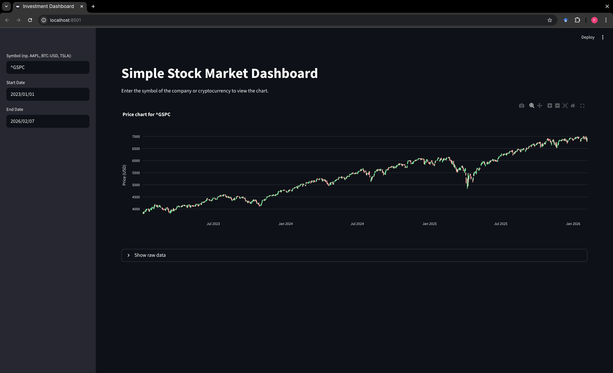

# Financial Data Dashboard: Real-Time Market Analysis

**Financial Data Dashboard** is a personal analytics tool designed to track and visualize stock market trends in real-time. Built with **Python** and **Streamlit**, the application integrates the **yfinance** API to fetch live market data, historical prices, and key financial metrics. Data is visualized using interactive **Plotly** charts, allowing for technical analysis through customizable moving averages and candlestick patterns.

## Project Overview

The primary goal of this project was to create a rapid, web-based interface for assessing stock performance and exporting financial data for further analysis.

### Key Features
* **Real-Time Data Fetching:** Live connection to Yahoo Finance API for stocks, ETFs, and cryptocurrencies (e.g., NVDA, BTC-USD).
* **Interactive Visualization:**
    * **Candlestick Charts:** Zoomable and pannable charts built with Plotly Graph Objects.
    * **Technical Indicators:** Dynamic **Simple Moving Average (SMA)** with an adjustable window slider.
* **Key Metrics Panel:** Immediate display of Last Price, Daily Change (%), and 52-Week High/Low.
* **Data Persistence:** One-click functionality to download historical datasets as CSV files.
* **Responsive UI:** Clean, sidebar-driven interface powered by Streamlit.

## Tech Stack & Architecture

### Core Technologies
* **Language:** Python 3.x
* **Web Framework:** Streamlit
* **Data Processing:** Pandas, NumPy
* **Visualization:** Plotly (Graph Objects)
* **Data Source:** yfinance (Yahoo Finance API)

### Dashboard Preview

 
*Above: Analysis of NVDA stock using the interactive dashboard.*

## Project Structure

The repository is organized for standard Python development.

    ├── src/
    │   └── app.py               # Main application logic (UI, Data Fetching, Plotting)
    ├── img/
    │   └── dashboard_preview.png # Screenshot of the app interface
    ├── .gitignore               # Standard exclusion rules
    ├── requirements.txt         # List of Python dependencies
    ├── LICENSE                  # MIT License
    └── README.md                # Project documentation

## Setup and Installation

To reproduce this project, you will need Python installed on your machine.

1. **Clone the repository:**

        git clone https://github.com/BeneNat/financial-data-dashboard.git
        cd financial-data-dashboard

2. **Install Dependencies:**
   Install the required libraries listed in `requirements.txt`:

        pip install -r requirements.txt

   *Note: This will install Streamlit, yfinance, pandas, and plotly.*

3. **Run the Application:**
   Execute the Streamlit app from the terminal:

        streamlit run src/app.py

4. **Access the Dashboard:**
   The application will automatically open in your default web browser at:
   `http://localhost:8501`

## Usage Guide

Once the interface is loaded:
1.  **Enter Ticker:** Type a stock symbol (e.g., `AAPL`, `TSLA`, `BTC-USD`) in the sidebar.
2.  **Select Date Range:** Choose the Start and End dates for historical data.
3.  **Adjust SMA:** Use the slider to change the moving average window (e.g., 20 or 50 days) to smooth out price trends.
4.  **Download:** Click the "Download data as CSV" button below the raw data table to save the dataset.

## Authors and Context
* **Author:** Filip Żurek
* **Project Type:** Personal Data Science Project
* **Domain:** FinTech, Data Visualization, Python Development

## License
This software is distributed under the MIT License. Refer to the [LICENSE](LICENSE) file for the full text.

---
*Financial Data Dashboard - Personal Project 2026*